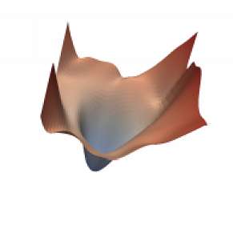

# simple-SAM
Sharpness-Aware Minimization for Efficiently Improving Generalization

-----------
This is an **unofficial** repository for [Sharpness-Aware Minimization for Efficiently Improving Generalization](https://arxiv.org/abs/2010.01412). <br> <br>
<ins>Shortened abstract:</ins> <br>
Optimizing only the training loss value, as is commonly done, can easily lead to suboptimal model quality. Motivated by the connection between
geometry of the loss landscape and generalization, SAM is a novel, effective procedure for instead simultaneously minimizing loss value
and loss sharpness. In particular, Sharpness-Aware Minimization (SAM), seeks
parameters that lie in neighborhoods having uniformly low loss, an optimization problem on which gradient descent can be performed efficiently.


The implementation uses Tensorflow 2 and is heavily inspired by [davda54's PyTorch implementation](https://github.com/davda54/sam).


|    |  | 
|:----------:|:-----------:|
| A sharp minimum to which a ResNet trained with SGD converged | A wide minimum to which the same ResNet trained with SAM converged. |


## Usage

Using SAM is easy in custom training loops:

```python
...

from sam import SAM

model = YourModel()
base_optimizer = tf.keras.optimizers.SGD()  # define an optimizer for the "sharpness-aware" update
optimizer = SAM(base_optimizer)

...

@tf.function
def train_step_SAM(images, labels):
    with tf.GradientTape() as tape:
        predictions = model(images, training=True)
        loss = loss_object(labels, predictions)
    gradients = tape.gradient(loss, model.trainable_variables)
    optimizer.first_step(gradients, model.trainable_variables)

    with tf.GradientTape() as tape:
        predictions = model(images, training=True)
        loss = loss_object(labels, predictions)
    gradients = tape.gradient(loss, model.trainable_variables)
    optimizer.second_step(gradients, model.trainable_variables)

...

for x, y in dataset:
    train_step_SAM(x, y)
  
...
```

If you want to use the Keras API:

```python
...

from sam import sam_train_step

# override the train_step function of the keras model
class YourModel(tf.keras.Model):
    def train_step(self, data):
        return sam_train_step(self, data)

inputs = Input(...)
outputs = ...
model = YourModel(inputs, outputs)

model.compile(...)
model.fit(x_train, y_train, epochs=3)

...
```

## Documentation

#### `SAM.__init__`

| **Argument**    | **Description** |
| :-------------- | :-------------- |
| `base_optimizer` (tf.keras.optimizers) | underlying optimizer that does the "sharpness-aware" update |
| `rho` (float, optional)           | size of the neighborhood for computing the max loss *(default: 0.05)* |

<br>
<br>

#### `SAM.first_step`

Performs the first optimization step that finds the weights with the highest loss in the local `rho`-neighborhood.

| **Argument**    | **Description** |
| :-------------- | :-------------- |
| `gradients`  | gradients computed by the first backward pass |
| `trainable_parameters` | model parameters to be trained |

<br>

#### `SAM.second_step`

Performs the second optimization step that updates the original weights with the gradient from the (locally) highest point in the loss landscape.

| **Argument**    | **Description** |
| :-------------- | :-------------- |
| `gradients`  | gradients computed by the second backward pass |
| `trainable_parameters` | model parameters to be trained |
